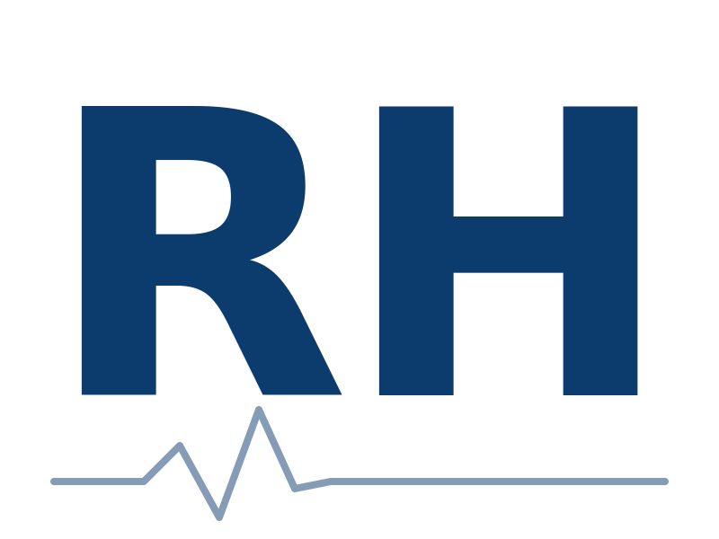
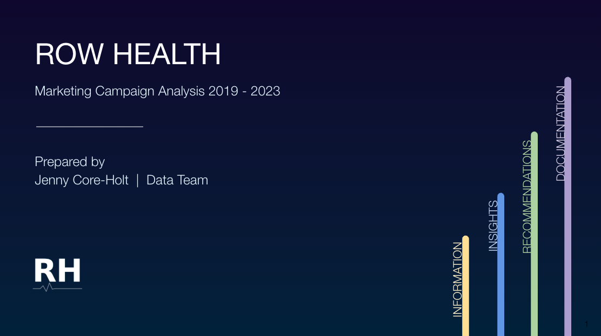
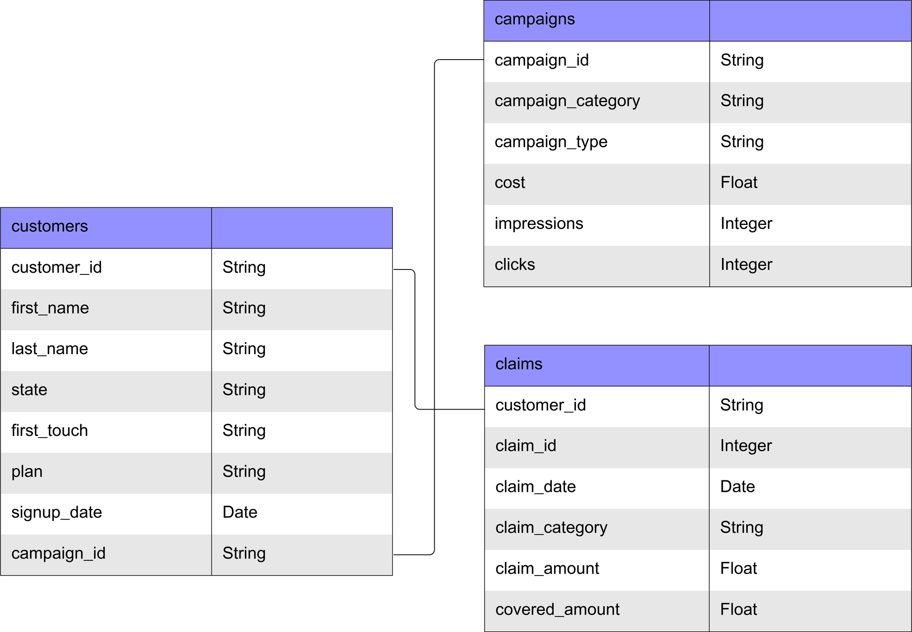
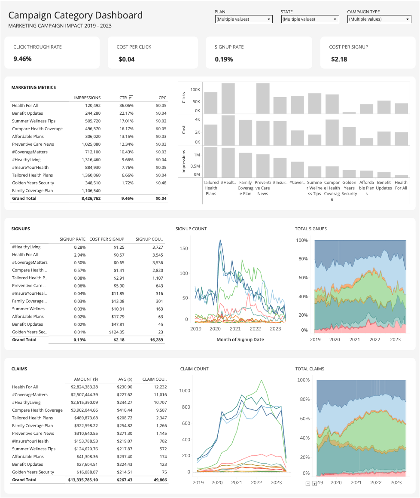
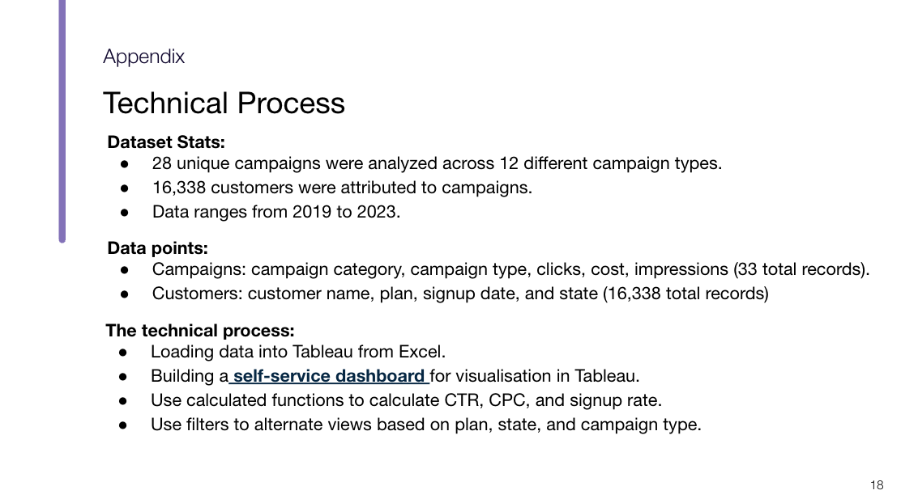
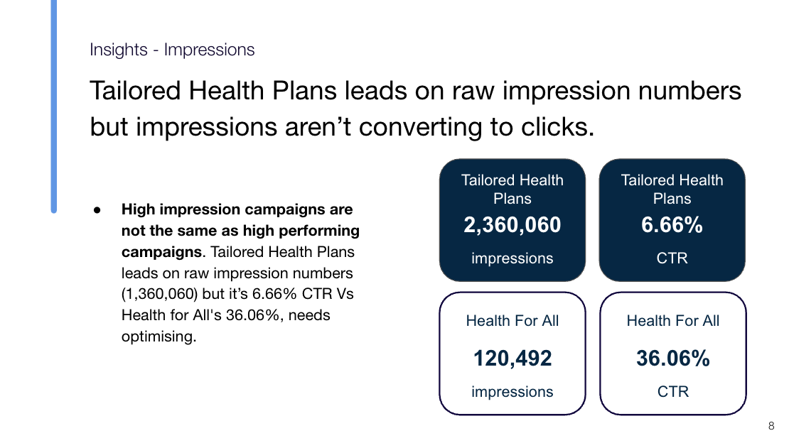
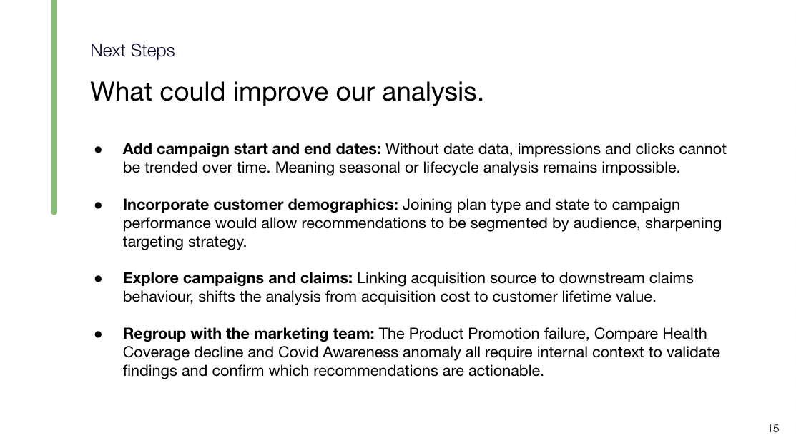

# Row Health Marketing Insights
An exploratory data analysis of Row Health's marketing campaign performance over 2019–2023, uncovering insights and recommendations for marketing stakeholders to inform future campaign strategy.

## About the Company
Founded in 2016, Row Health is a medical insurance company serving thousands of customers throughout the United States. In 2019, they launched a new set of marketing campaign categories spanning topics like wellness tips, plan affordability, and preventative care. Customers can sign up for four plans — bronze, silver, gold, and platinum — each with different premiums and claim coverage rates.

Now that they've hired a new data team and are strategising their marketing budget for the year, the company would like to better understand the effectiveness of these campaign categories and how they relate to signups and subsequent patient claims.

## Data Structure
This analysis uses Row Health's marketing data across three tables: customers, campaigns, and claims. The data contains information on customer demographics, signups, campaign types, claim categories, and claim amounts.

## Insights Summary

### Signup Performance 
- Health For All exceeded the signup rate performance of all campaigns (2.94%) and had the second highest signup count (3.5K).
- Health Awareness (under Health For All) was responsible for its signup rate performance at 3.72%.
- Compare Health Coverage diverged from all other campaigns during the 2020 peak, accounting for nearly 1 in 3 signups in December 2021.

### Impressions 
- High impression campaigns are not the same as high performing campaigns. Tailored Health Plans leads on raw impressions (1,360,060) but its 6.66% CTR versus Health For All's 36.06% indicates a significant engagement gap that needs addressing.

### Click Through Rate
- Health For All's overall CTR of 36.06% is nearly 4× the all-campaign average.
- Health Awareness (49.26% CTR) is the sole driver of this performance.
- Product Promotion (under Health For All) has 0% CTR despite 32,272 impressions — indicating a likely technical failure rather than a performance issue.

### Cost Per Signup
- Golden Years Security ($124 CPS) and Benefit Updates — Policy Information ($120 CPS) incur the highest costs at near-zero signup rates.
- Covid Awareness campaign types show an abnormally high CPS of $1.3K–$1.4K, signalling a process issue rather than a performance outlier.
- Product Promotion is the quiet overperformer — consistently delivering low CPS and high signup counts across multiple campaign categories.

## Recommendations

### Immediate Actions
- **Health For All, Product Promotion**: Investigate the 0% CTR on 32,272 impressions. Given that Product Promotion drives signups effectively elsewhere, this points to a technical failure. Escalate to marketing and development teams.
- **Golden Years Security and Benefit Updates (Policy Information)**: Reallocate budget away from these campaigns. At $124 and $120 CPS with near-zero signup rates, they represent the clearest budget drain in the portfolio.
- **Covid Awareness**: Investigate the $1.26K–$1.37K CPS anomaly. This is not a performance issue — it signals a breakdown in how this campaign type is being deployed in certain categories.

### Short Term
- **Compare Health Coverage**: Investigate the sharp decline following its December 2021 peak, where it was responsible for nearly 1 in 3 signups. Whether driven by budget, strategy, or external factors, restoring its performance would have an outsized impact on overall signup volume.
- **Impression Spend Rebalancing**: Tailored Health Plans' dominance in impression share is not matched by engagement (6.66% CTR vs Health For All's 36.06%). Shifting budget toward higher-CTR campaigns would improve portfolio efficiency without increasing total spend.

### Strategic
- **Product Promotion Campaign Type**: Scale this campaign type across the portfolio. It consistently delivers low CPS and high signup counts across Family Coverage Plan, #InsureYourHealth, #CoverageMatters, and #HealthyLiving.
- **Health Awareness**: Use Health For All's Health Awareness performance (3.72% signup rate, 49.26% CTR) as the portfolio benchmark. Analyse the targeting, creative, and audience decisions behind it and test whether the model can be applied to underperforming categories.

## Dashboard
An interative [Tableau Dashboard](https://public.tableau.com/views/CampaignCategoryDashboard_17822285891110/Dashboard1?:language=en-GB&:sid=&:redirect=auth&:display_count=n&:origin=viz_share_link) was built for the marketing team, enabling filtering by plan, state, and campaign type. The dashboard is segmented into key metric areas to address stakeholder questions across marketing performance, signups, and claims.

## Presentation Sample
A [presentation](https://docs.google.com/presentation/d/11Cp0KcpAJcHOUhoPYogS5p-zZXZl7MRN/edit?usp=sharing&ouid=106037522742432770650&rtpof=true&sd=true) was produced for the Row Health marketing team, breaking down campaign performance insights over the four-year period with findings and recommendations.

